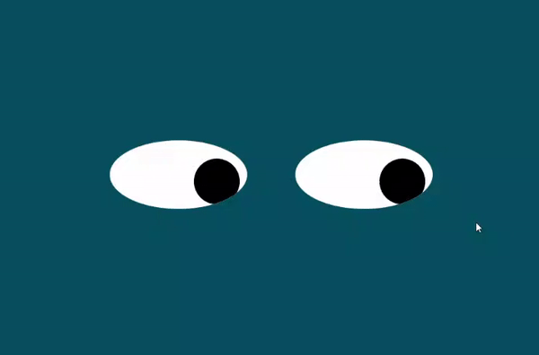

# Eye Exercise

This program was developed as part of the requirement for week 8 of MIT xPro Web Development With JavaScript course.

## Description

A set of eyes follow the cursor movement of the user. This is a fun little exercise that tracks movements of the mouse
and translates the coordinates and animates the eyeballs in relation to that.

Though this is a toy app, it highlights some key concepts in JavaScript, HTML, CSS and DOM manipulation techniques.

## How to Run

Download or clone the project to your local machine. Then you can run the program by following either options below.

- Option 1: Drag and drop the index.html file inside the src folder to the web browser.
- Option 2: Install a web server via npm like bsync or http-server. Then run the server inside the src folder to serve
  index.html.

## Roadmap of Future Improvements

Some ideas for future improvements include:

- add more sets of eyes
- add facial features
- when mouse goes between eyes, make eyes crossed

## License

MIT License

Copyright (c) 2021 Sanjib Ahmad

Permission is hereby granted, free of charge, to any person obtaining a copy of this software and associated
documentation files (the "Software"), to deal in the Software without restriction, including without limitation the
rights to use, copy, modify, merge, publish, distribute, sublicense, and/or sell copies of the Software, and to permit
persons to whom the Software is furnished to do so, subject to the following conditions:

The above copyright notice and this permission notice shall be included in all copies or substantial portions of the
Software.

THE SOFTWARE IS PROVIDED "AS IS", WITHOUT WARRANTY OF ANY KIND, EXPRESS OR IMPLIED, INCLUDING BUT NOT LIMITED TO THE
WARRANTIES OF MERCHANTABILITY, FITNESS FOR A PARTICULAR PURPOSE AND NONINFRINGEMENT. IN NO EVENT SHALL THE AUTHORS OR
COPYRIGHT HOLDERS BE LIABLE FOR ANY CLAIM, DAMAGES OR OTHER LIABILITY, WHETHER IN AN ACTION OF CONTRACT, TORT OR
OTHERWISE, ARISING FROM, OUT OF OR IN CONNECTION WITH THE SOFTWARE OR THE USE OR OTHER DEALINGS IN THE SOFTWARE.